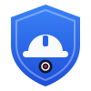
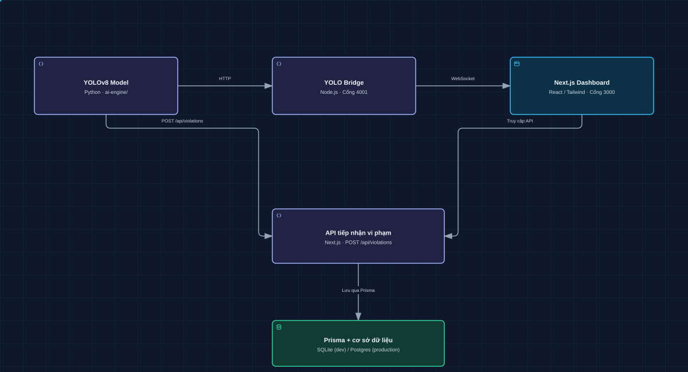

<div align="center">

  

  <h1>🦺 SafeSight</h1>

  <p><strong>Giám sát an toàn lao động bằng AI theo thời gian thực</strong></p>

  <p><em>YOLOv8 nhìn thấy người thiếu mũ, áo, găng, giày bảo hộ trên công trường;<br>dashboard ghi bằng chứng, cảnh báo Telegram và loa, agent tự động trực vận hành.</em></p>

  <br>

  [](./LICENSE)
  [](https://github.com/nguyenbaquyen075/safesight-instructions/actions/workflows/ci.yml)
  [](https://github.com/nguyenbaquyen075/safesight-instructions/pkgs/container/safesight-instructions%2Fdashboard)
  [](./src)
  [](./ai-engine)
  [](./prisma)

  <br>

  [](https://github.com/nguyenbaquyen075/safesight-instructions/releases)
  [](https://github.com/nguyenbaquyen075/safesight-instructions/stargazers)
  [](https://github.com/nguyenbaquyen075/safesight-instructions/issues)
  [](https://github.com/nguyenbaquyen075/safesight-instructions/commits/main)
  [](https://nguyenbaquyen075.github.io/safesight-instructions/)

</div>

---

## Landing page

Art direction **industrial editorial**: hero bất đối xứng, ảnh công trường khổ lớn, typography sans/serif, lưới tính năng đánh số; light ivory và dark charcoal-green, giữ xanh thương hiệu cho CTA.

`landing-page/index.html` là landing độc lập cho GitHub Pages, không thay route `/` của dashboard. Giao diện responsive sáng/tối theo hệ thống, có nút chuyển lưu lựa chọn; menu mobile và FAQ dùng tương tác native. Không cần cài thêm dependency hay chạy AI/DB để xem.

Mở trực tiếp `landing-page/index.html` trong trình duyệt để preview local. CSS, JavaScript, logo và ảnh minh họa nằm trong `landing-page/`; ảnh được trích từ video mẫu `public/videos/safety-construction-workers-helmets-46753.mp4`. Preview và bounding box là minh họa, không phải inference thực. Thiết kế ghi tại `DESIGN.md`.

Workflow Pages hiện có đóng gói thư mục này thành artifact; chỉ deploy khi được phê duyệt. Landing không yêu cầu đổi cấu hình production.

## 🌟 Giới thiệu

**SafeSight** là hệ thống mã nguồn mở giám sát vi phạm trang bị bảo hộ lao động (PPE) trên công trường xây dựng theo thời gian thực. AI engine chạy **YOLOv8** trên máy tại chỗ, không gửi video lên cloud; dashboard **Next.js** hiển thị camera trực tiếp kèm khung nhận diện, lưu vi phạm với bằng chứng ảnh, cảnh báo qua **Telegram** và **loa công trường**, và một **agent giám sát tự động** trực vận hành 24/7 rồi rà soát từng vi phạm theo bằng chứng.

Phát hiện bốn món PPE bắt buộc: **mũ bảo hộ, áo phản quang, găng tay, giày bảo hộ**. Vi phạm chỉ được chốt khi thấy liên tục ≥3s để giảm báo động giả, và model được nghiệm thu theo tỉ lệ báo oan / bỏ sót thay vì mAP.

## ✨ Tính năng

| | Tính năng | Chi tiết |
|---|---|---|
| 🦺 | **Phát hiện PPE theo thời gian thực** | YOLOv8 11 lớp + model phụ găng/giày + pose keypoints; theo dõi track ID, xác nhận vi phạm ≥3s |
| 📸 | **Bằng chứng ảnh** | Snapshot khoanh khung tại đầu, cổ tay, cổ chân; đếm số lần tái diễn; báo lại mỗi 60s khi kéo dài |
| 📡 | **Overlay trực tiếp** | Bridge Socket.IO phát detection theo room từng camera, dashboard vẽ khung trên video |
| 📣 | **Cảnh báo đa kênh** | Quy tắc cảnh báo theo công trường (ngưỡng, thời gian chờ), Telegram nhắc nhở rồi leo thang, mic → loa công trường |
| 🤖 | **Agent giám sát tự động** | Trực vận hành tất định (camera/engine/bridge đứng, đĩa đầy), cán bộ an toàn dùng Claude rà soát vi phạm, hỏi đáp trên `/agent` |
| 🔐 | **Đa tổ chức, phân quyền** | Organization → Site → Camera, RBAC theo vai trò, NextAuth |
| 🔬 | **Nghiệm thu bằng số liệu** | `eval_ppe_decision.py`, `sweep_threshold.py`, đối chiếu Roboflow trên ảnh tĩnh |
| 🐳 | **Đóng gói** | Image Docker trên GHCR, `docker compose up`, CI lint/types/tests, Release tự động theo tag |

## 🏗️ Kiến trúc hệ thống



Sơ đồ là SVG có chuyển động minh họa luồng dữ liệu (tự theo theme sáng/tối của trình duyệt); nguồn tại [`wiki/assets/yolo-architecture-animated-dark.svg`](./wiki/assets/yolo-architecture-animated-dark.svg).

- **AI Engine** (`ai-engine/`) — Python/YOLOv8 nhận diện PPE + `ppe_tracker.py` theo dõi đối tượng (track ID), xác nhận vi phạm sau khi thấy liên tục ≥3s để giảm báo động giả. Gửi detection cho `yolo_bridge.js` (overlay real-time) và ghi violation đã xác nhận vào DB qua Next.js API.
- **YOLO Bridge** (`ai-engine/yolo_bridge.js`) — Server Socket.IO trung gian, broadcast detection theo room từng camera (đỡ băng thông cho client chỉ xem 1 camera).
- **Next.js Dashboard** (`src/`) — Giao diện xem live camera, danh sách vi phạm, thống kê; API routes (`src/app/api/`) + Prisma ORM lưu trữ dữ liệu thật.

## 🚀 Cài đặt nhanh

### Yêu cầu hệ thống

- Node.js >= 18, npm
- Python >= 3.9 với `torch`, `ultralytics`, `opencv-python`, `requests` (khuyến nghị dùng `.venv`)

### Cài đặt từ mã nguồn

```bash
# 1. Dependencies Next.js
npm install

# 2. Dependencies Python (trong .venv)
python3 -m venv .venv
.venv/bin/pip install ultralytics opencv-python requests

# 3. Biến môi trường — tạo .env.local (KHÔNG commit, đã gitignore)
cp .env .env.local   # rồi chỉnh DATABASE_URL, NEXTAUTH_SECRET, NEXT_PUBLIC_YOLO_SERVER_URL,
                      # và AI_ENGINE_SECRET (bắt buộc — POST /api/violations từ chối request
                      # thiếu header X-AI-Engine-Secret khớp giá trị này, sinh bằng
                      # `openssl rand -base64 24`)
                      #
                      # TELEGRAM_ENCRYPT_KEY (bắt buộc — dùng mã hoá bot token Telegram lưu
                      # trong DB, app throw lỗi "TELEGRAM_ENCRYPT_KEY is not set" ngay lần
                      # đầu lưu token nếu thiếu, sinh bằng
                      # `node -e "console.log(require('crypto').randomBytes(32).toString('base64'))"`)
                      #
                      # ROBOFLOW_API_KEY (tuỳ chọn — chỉ cần nếu dùng Roboflow Workflow để
                      # đối chiếu kết quả trên ảnh tĩnh, xem mục "Đối chiếu bằng Roboflow
                      # Workflow" bên dưới; lấy ở app.roboflow.com/settings/api)
                      #
                      # AGENT_BRIDGE_SECRET (bắt buộc để Next đánh thức agent và gửi câu hỏi từ
                      # panel; thiếu thì agent vẫn chạy theo chu kỳ 20s, sinh bằng
                      # `openssl rand -base64 24`)
                      #
                      # ALLOW_DEV_LOGIN (tuỳ chọn — tài khoản thử nghiệm admin@safesight.ai/password123 chỉ
                      # hoạt động khi NODE_ENV khác production; đặt =true để cố ý mở nó trên bản build)
                      #
# ANTHROPIC_API_KEY (tuỳ chọn — mở lane nghiên cứu của agent: review vi
                      # phạm bằng ảnh, báo cáo ca, hỏi đáp; thiếu thì chỉ chạy trực vận hành)
                      #
                      # LLM_PROVIDER (tuỳ chọn — `anthropic` mặc định; đặt `openai` nếu key là
                      # proxy tương thích OpenAI `/chat/completions`)
                      # LLM_BASE_URL (tuỳ chọn — URL gốc của endpoint, mặc định lấy
                      # ANTHROPIC_BASE_URL)
                      # LLM_API_KEY (tuỳ chọn — key của endpoint trên, mặc định lấy
                      # ANTHROPIC_API_KEY)
                      # LLM_MODEL_DEFAULT (tuỳ chọn — tên model ghi vào cài đặt agent lần đầu)
                      # LLM_IMAGE_INPUT (tuỳ chọn — `true` để gửi ảnh snapshot sang endpoint
                      # openai; mặc định bỏ ảnh vì nhiều proxy không nhận)
                      # Xem wiki/09-agent.md mục "Nhà cung cấp LLM".

# 4. Khởi tạo DB + seed dữ liệu Camera/Site tối thiểu (bắt buộc, nếu không
#    Violation write sẽ lỗi 404 vì cameraId chưa tồn tại)
npx prisma db push
npm run db:seed
```

### Chạy dự án

```bash
npm run dev
```

Lệnh này chạy `dev-all.sh`, tự khởi động cả 4 tiến trình cùng lúc (Ctrl+C tắt tất cả):

| Tiến trình | Lệnh riêng lẻ | Port |
|---|---|---|
| Next.js Dashboard | `npm run dev:web` | 3000 |
| YOLO Bridge (Socket.IO) | `npm run dev:bridge` | 4001 |
| YOLO Inference (Python) | `npm run dev:yolo` | — (POST tới bridge + API) |
| Agent (trực vận hành + cán bộ an toàn) | `npm run dev:agent` | 4002 (nội bộ) |

Truy cập dashboard tại [http://localhost:3000](http://localhost:3000).

### Chạy bằng Docker (Dashboard + Bridge)

Hai image được CI build và đẩy lên GitHub Container Registry mỗi khi `main` thay đổi hoặc có tag mới
(xem [Packages](https://github.com/nguyenbaquyen075/safesight-instructions/pkgs/container/safesight-instructions%2Fdashboard)):

| Image | Nội dung | Cổng |
|---|---|---|
| `ghcr.io/nguyenbaquyen075/safesight-instructions/dashboard` | Next.js dashboard + API, SQLite tại bind mount `./data` | 3000 |
| `ghcr.io/nguyenbaquyen075/safesight-instructions/bridge` | YOLO Bridge Socket.IO | 4001 |

```bash
cp .env.docker.example .env      # điền NEXTAUTH_SECRET, AI_ENGINE_SECRET, TELEGRAM_ENCRYPT_KEY, AGENT_BRIDGE_SECRET
mkdir -p data public/snapshots   # tạo trước để không bị Docker tạo bằng quyền root
docker compose up -d             # kéo image từ GHCR; thêm --build để build tại chỗ
```

Lần chạy đầu container tự tạo `dev.db` đã seed (Organization/Site/Camera mẫu) trong `./data` — thư mục
này và `./public/snapshots` là bind mount dùng chung với AI engine/agent chạy trên host (cần
`DATABASE_URL=file:./data/dev.db` khi trỏ vào Docker). AI engine (Python, cần model `.pt`, webcam/GPU) và
agent vẫn chạy ngoài container bằng `npm run dev:yolo` / `npm run dev:agent`, trỏ `NEXT_PUBLIC_YOLO_SERVER_URL`
và API về địa chỉ máy chạy Docker. `AI_ENGINE_SECRET` giờ cũng bảo vệ `POST /detections` của bridge, không
chỉ `POST /api/violations`. Tag image: `latest` (main), `0.6.0` / `0.6` (release), `main`, mã commit ngắn.

## 🤖 Agent giám sát tự động

Tiến trình thứ 4 (`agent/`, port 4002 nội bộ), khởi động cùng `npm run dev`. Ba vai trò:

1. **Trực vận hành** — tất định, không cần model: phát hiện camera/AI engine/bridge đứng, đĩa đầy, thiếu model; tự khắc phục trong giới hạn tần suất. Chạy được cả khi thiếu `ANTHROPIC_API_KEY`.
2. **Cán bộ an toàn** — Claude Tool Runner: review từng vi phạm bằng snapshot + lịch sử, phán quyết theo bằng chứng, leo thang Telegram, digest theo camera, báo cáo ca. Cần `ANTHROPIC_API_KEY`.
3. **Trợ lý hỏi đáp** — trang `/agent` và tab Agent trong modal vi phạm/camera/site.

- **Bật/tắt:** kill switch trên trang `/agent` (`AgentSettings.isEnabled`), hoặc để trống `ANTHROPIC_API_KEY` để chỉ giữ lane trực vận hành.
- **Chạy riêng:** `npm run dev:agent`; kiểm tra sức khoẻ: `curl 127.0.0.1:4002/health`.

Chi tiết đầy đủ (hàng đợi, bằng chứng/band, tool, rào chắn, panel): [`wiki/09-agent.md`](wiki/09-agent.md).

## 🧠 AI Engine

### Cấu hình

Model, ngưỡng confidence và các tham số nhận diện nằm ở đầu file `ai-engine/yolo_inference.py` và trong `PPEViolationTracker` (`ai-engine/ppe_tracker.py`):

- `MODEL_PATH` — model YOLOv8 đã train PPE (đặt file `.pt` ở gốc repo, không commit — xem `.gitignore`).
- `CONFIRM_CONF` / `CONFIRM_DELAY` — ngưỡng độ tin cậy và thời gian tồn tại liên tục tối thiểu trước khi CHỐT một vi phạm để ghi DB (mặc định 0.6 / 3 giây), giảm báo động giả.
- Nguồn video/camera map tại `src/data/camera-videos.json`.

### File model cần có (KHÔNG nằm trong repo)

Mọi file `.pt` đều bị `.gitignore` chặn. Máy mới clone về phải chép tay:

| file | vai trò | thiếu thì sao |
|---|---|---|
| `ppe_multiclass.pt` | model chính 11 lớp — người, mũ, áo (và găng/giày khi thiếu model phụ) | **không chạy được** |
| `ppe_boots.pt` | model phụ, CHỈ lớp giày | chạy tiếp bằng model chính, giày bỏ lọt cao hơn |
| `ppe_gang.pt` | model phụ, CHỈ lớp găng | chạy tiếp bằng model chính, găng bỏ lọt cao hơn |
| `yolov8n-pose.pt` | toạ độ cổ tay/cổ chân để đặt khung "THIẾU GĂNG/GIÀY" | chạy tiếp, mất khung chỉ chỗ (ultralytics tự tải nếu có mạng) |

Ba file phụ đều có đường lui, chỉ `ppe_multiclass.pt` là bắt buộc.

Nghiệm thu sau khi thay model — chạy cả hai, đừng tin mAP:

```bash
.venv/bin/python ai-engine/eval_ppe_decision.py            # báo oan / bỏ lọt, 4 lớp
.venv/bin/python ai-engine/sweep_threshold.py <model> boots [model_phụ]  # quét ngưỡng
```

### Đối chiếu bằng Roboflow Workflow (ảnh tĩnh)

`ai-engine/roboflow_workflow.py` gọi workflow **"Detech PPE vdetech-ppe-7qydu-vnlwm-1-yolo26n-t2 Logic"**
trên Roboflow Serverless để nhận diện PPE trên **một ảnh tĩnh** — dùng khi cần đối chiếu
model cloud với model local `ppe_multiclass.pt`. Pipeline camera trực tiếp **vẫn chạy model
local**, không gọi cloud từng frame (tốn credit + trễ mạng).

```python
from roboflow_workflow import detect_ppe

detect_ppe("anh.jpg")                     # đường dẫn file
detect_ppe(frame)                         # frame OpenCV (numpy BGR)
detect_ppe("https://.../anh.jpg")         # URL, bắt buộc https
# -> [{"class": "Person", "confidence": 0.87,
#      "bbox": {"left": "...%", "top": "...%", "width": "...%", "height": "...%"}}, ...]
```

`bbox` trả về theo dạng phần trăm giống `_bbox_pct()` trong `ppe_tracker.py`, nên dùng lại
được ngay với dashboard và `_draw_violation_box()`. Cần `ROBOFLOW_API_KEY` trong `.env.local`.

**Hai workflow dùng chung một client.** Spec của cả hai giống hệt nhau (input `image`, không
parameter, output `predictions`) nên `detect_ppe()` nhận thêm tham số `workflow`:

| Key | Workflow | Model bên trong |
|---|---|---|
| `detech-ppe` (mặc định) | Detech PPE vdetech-ppe-7qydu-vnlwm-1-yolo26n-t2 Logic | `detech-ppe-7qydu-vnlwm-1-yolo26n-t2` |
| `ppes-kaxsi` | PPEs vppes-kaxsi-ea9pf-1-yolo11n-t1 Logic | `ppes-kaxsi-ea9pf-1-yolo11n-t1` |

```python
detect_ppe(frame, workflow="ppes-kaxsi")
```

⚠️ Hai model **khác từ vựng lớp**: `detech-ppe` trả `gloves` (số nhiều, khớp `ppe_tracker.py`),
`ppes-kaxsi` trả `glove` (số ít). Muốn map sang tracker phải chuẩn hoá tên trước.

Smoke test (gọi mạng thật, tốn 1 credit):

```bash
.venv/bin/python ai-engine/test_roboflow_workflow.py
```

#### Demo đo độ ổn định trên nguồn video

`ai-engine/demo_roboflow_stream.py` lấy mẫu frame từ một nguồn video, gửi lên Roboflow theo
nhịp rồi báo cáo tỉ lệ thành công / độ trễ — dùng để **kiểm chứng** trước khi tin dùng.
Đây là công cụ đo, không phải pipeline production. **Mỗi frame gửi đi = 1 credit.**

```bash
.venv/bin/python ai-engine/demo_roboflow_stream.py                       # video mẫu, 20 frame
.venv/bin/python ai-engine/demo_roboflow_stream.py --source 0            # webcam
.venv/bin/python ai-engine/demo_roboflow_stream.py --source rtsp://...   # camera IP
.venv/bin/python ai-engine/demo_roboflow_stream.py --frames 50
```

Ảnh đã khoanh khung được lưu sẵn vào `public/snapshots/roboflow/` (đã gitignore), tên file
kèm số detection — `rf_002_2det.jpg`, `rf_003_0det.jpg` — nên lướt thư mục là biết ngay frame
nào bắt được gì, khỏi phải render video. Truyền `--save-dir ""` nếu không muốn lưu.

Thoát `0` nếu mọi lần gọi thành công, `1` nếu có lần trượt.

#### Xem trực tiếp trên dashboard

Trang **`/roboflow`** ("Kiểm thử Roboflow" ở thanh bên) cho kéo thả một ảnh rồi hiện luôn
khung detection kèm class/confidence và độ trễ — dùng khi muốn mắt thường đối chiếu model
cloud với model local, khỏi chạy script.

- Ảnh được thu nhỏ về 640px **ngay trên trình duyệt** (canvas) trước khi gửi, giống
  `MAX_IMAGE_SIDE` trong `roboflow_workflow.py`.
- `POST /api/roboflow` giữ `ROBOFLOW_API_KEY` ở phía server — trình duyệt không bao giờ
  thấy key, nên không gọi thẳng Roboflow từ client.
- Route **bắt buộc đăng nhập** và trang chỉ mở cho `SUPER_ADMIN` / `ORG_ADMIN`, vì
  **mỗi lần chạy tốn 1 credit Roboflow**.
- Chọn model bằng 2 nút ở đầu trang; đổi model sẽ chạy lại đúng ảnh đang xem (tốn thêm
  1 credit). Client chỉ gửi được key trong allowlist của route, không truyền slug tuỳ ý.

## 📂 Cấu trúc thư mục

```
├── src/                       # Next.js App Router (dashboard + API routes)
│   ├── app/api/                #   REST endpoints (Prisma)
│   ├── components/             #   UI components
│   ├── hooks/                  #   useYolo, useCameras, useViolations...
│   └── data/                   #   mock data + camera-videos.json
├── agent/                      # Agent giám sát tự động (tiến trình thứ 4, port 4002)
│   ├── main.ts                 #   Vòng lặp claimDue() 20s cho 2 lane
│   ├── direct/                 #   Lane trực vận hành (sweep, tất định)
│   ├── session.ts, research/   #   Lane cán bộ an toàn (Claude Tool Runner)
│   ├── tools/                  #   10 tool, mỗi file một tool
│   └── skills/                 #   Skill markdown nạp vào system prompt
├── ai-engine/                  # AI/CV engine (Python + bridge Node.js)
│   ├── yolo_inference.py       #   Vòng lặp inference chính
│   ├── ppe_tracker.py          #   Logic tracking + xác nhận vi phạm
│   ├── eval_ppe_decision.py    #   Nghiệm thu báo oan / bỏ lọt
│   ├── sweep_threshold.py      #   Quét ngưỡng theo lớp
│   ├── roboflow_workflow.py    #   Client Roboflow Workflow (ảnh tĩnh, đối chiếu)
│   ├── demo_roboflow_stream.py #   Demo đo độ ổn định Roboflow trên nguồn video
│   └── yolo_bridge.js          #   Socket.IO bridge (room theo camera)
├── prisma/                     # Schema DB + seed script
├── public/videos/              # Video mẫu cho demo AI
├── training/                   # Script/tài liệu train lại model YOLOv8
└── wiki/                       # Tài liệu kiến trúc & vận hành chi tiết
```

## 🏷️ Các lớp (class) được nhận diện

| Class | Trạng thái |
|-------|-----------|
| `helmet`, `vest`, `gloves`, `boots`, `goggles` | ✅ An toàn |
| Thiếu `helmet`, `vest`, `gloves`, `boots` (4 món bắt buộc trong `required_ppe`) | ❌ Vi phạm → ghi DB |
| `goggles` | Có trong model, chưa bắt buộc |

Model không có lớp `no_vest`; "thiếu áo" suy ra khi không thấy `vest` trên người trong cửa sổ bằng chứng. Xem `wiki/06-tich-hop-yolo.md`.

## 📚 Tài liệu

Tài liệu kỹ thuật nằm trong [`wiki/`](./wiki/README.md); tài liệu nghiệp vụ (BA) trong [`docs/ba/`](./docs/ba/README.md):

| | Tài liệu | Nội dung |
|---|---|---|
| 📖 | [Giới thiệu & phạm vi](./wiki/01-gioi-thieu.md) | Bài toán, giá trị, phạm vi hệ thống |
| 🏗️ | [Kiến trúc hệ thống](./wiki/02-kien-truc-he-thong.md) | 4 tiến trình, luồng ghi DB, Telegram |
| ⚙️ | [Cài đặt & vận hành](./wiki/03-cai-dat-va-van-hanh.md) | Biến môi trường, file model, Docker, lệnh npm |
| 🗄️ | [Mô hình dữ liệu](./wiki/04-mo-hinh-du-lieu.md) | Domain model Prisma, ánh xạ PPE → ViolationType |
| 🖥️ | [Giao diện & API](./wiki/05-giao-dien-va-api.md) | Trang, quyền xem, API route, hooks |
| 🧠 | [Tích hợp YOLO](./wiki/06-tich-hop-yolo.md) | Pipeline nhận diện, lớp phát hiện, Roboflow |
| 🗺️ | [Lộ trình phát triển](./wiki/07-lo-trinh-phat-trien.md) | Đã xong, ưu tiên tiếp theo |
| 🎓 | [Train lại model găng/giày](./wiki/08-train-model-them-ppe.md) | Dataset gộp, Colab, nghiệm thu |
| 🤖 | [Agent giám sát tự động](./wiki/09-agent.md) | Hàng đợi, bằng chứng/band, tool, rào chắn |
| 📋 | [Bộ tài liệu BA](./docs/ba/README.md) | SRS, URD, BRD, HDSD, biên bản họp và 15 sản phẩm phân tích nghiệp vụ (BPMN, use case, user story, NFR…) |
| 📐 | [Spec & plan thiết kế](./docs/superpowers) | Bản thiết kế đã duyệt và kế hoạch triển khai |
| 🎨 | [DESIGN.md](./DESIGN.md) | Token màu, chữ, khoảng cách của dashboard |

## 🏷️ Phiên bản & Release

Lịch sử thay đổi theo từng phiên bản ở [`CHANGELOG.md`](./CHANGELOG.md); mỗi tag `vX.Y.Z` được workflow `.github/workflows/release.yml` tự động chuyển thành [GitHub Release](https://github.com/nguyenbaquyen075/safesight-instructions/releases). Quy trình phát hành: cập nhật `CHANGELOG.md` và `version` trong `package.json`, commit lên `main`, rồi `git tag -a vX.Y.Z -m "SafeSight vX.Y.Z" && git push origin vX.Y.Z`. Với tag trỏ vào commit cũ chưa có workflow, vào Actions → Release → "Run workflow": workflow sẽ tạo Release cho mọi tag còn thiếu.

## 🤝 Đóng góp

Pull Request và Issue đều được hoan nghênh. Đọc [`CONTRIBUTING.md`](./CONTRIBUTING.md) (quy trình, kiểm tra trước khi gửi) và [`AGENTS.md`](./AGENTS.md) (quy ước code, commit, tài liệu). Danh sách thành viên: [`CONTRIBUTORS.md`](./CONTRIBUTORS.md).

## 📜 Giấy phép

Phát hành theo giấy phép **MIT** (OSI-approved) — xem toàn văn tại [`LICENSE`](./LICENSE). Chọn MIT vì đây là giấy phép permissive, cho phép sử dụng/sửa đổi/phân phối tự do kể cả mục đích thương mại, phù hợp mục tiêu phổ biến rộng rãi giải pháp an toàn lao động nguồn mở.

## 🔗 Tài liệu tham khảo

- [Next.js Documentation](https://nextjs.org/docs)
- [Ultralytics YOLOv8](https://docs.ultralytics.com/)
- [Socket.IO](https://socket.io/docs/)
- [Prisma](https://www.prisma.io/docs)
