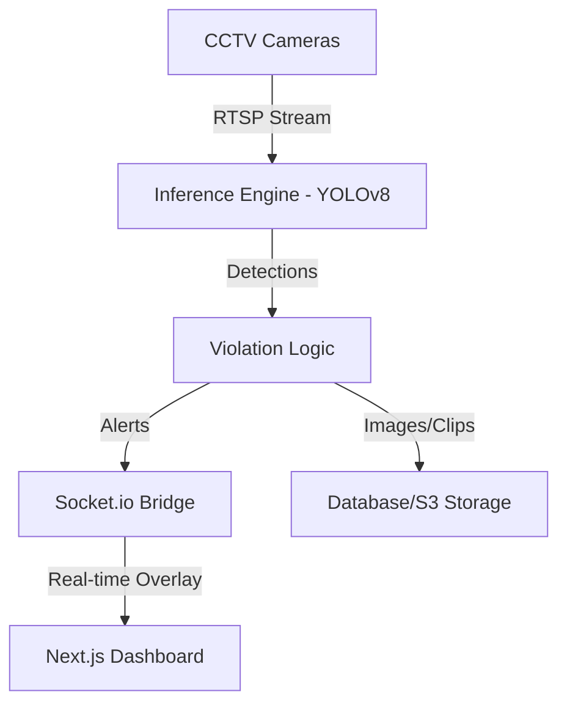

# Hệ Thống Phát Hiện Vi Phạm PPE (Mũ & Áo Bảo Hộ) sử dụng YOLOv8

Chào bạn, tôi là AI Engineer của SafeSight AI. Dưới đây là giải pháp tối ưu để xây dựng hệ thống phát hiện vi phạm PPE (Personal Protective Equipment) cho công trường xây dựng.

## 1. Kiến Trúc Hệ Thống (System Architecture)

Hệ thống được thiết kế theo mô hình **Edge-to-Cloud/Dashboard**:
*   **Data Source:** RTSP Streams từ camera CCTV tại công trường.
*   **Inference Engine:** Máy chủ AI (GPU-based) chạy Python với mô hình YOLOv8.
*   **Message Broker:** Socket.io hoặc MQTT để truyền tin nhắn thời gian thực.
*   **Frontend Dashboard:** React/Next.js hiển thị video overlay và danh sách vi phạm.



## 2. Pipeline Xử Lý Video (Video Processing Pipeline)

1.  **Frame Acquisition:** Sử dụng OpenCV hoặc GStreamer để đọc frame từ stream.
2.  **Pre-processing:** Resize (640x640), Normalization.
3.  **Inference:** Chạy model YOLOv8 để lấy danh sách bounding boxes cho `person`, `helmet`, `safety-vest`.
4.  **Association Logic (IoU Analysis):**
    *   Sử dụng toán học để kiểm tra xem `helmet` và `vest` có nằm trong vùng của `person` hay không.
    *   Nếu một `person` không có `helmet` HOẶC không có `vest` gán kèm -> **Vi Phạm**.
5.  **Post-processing:** Vẽ overlay và gửi thông báo.

## 3. Train Custom Dataset PPE

Để đạt độ chính xác cao trong môi trường thực tế, ta cần train lại YOLOv8:
*   **Dataset:** Sử dụng các bộ dữ liệu như *Roboflow PPE Dataset* hoặc tự thu thập.
*   **Classes:** `0: person`, `1: helmet`, `2: no-helmet`, `3: vest`, `4: no-vest`.
*   **Training Script:**
```python
from ultralytics import YOLO
model = YOLO('yolov8n.pt') # Sử dụng bản Nano để tối ưu tốc độ
model.train(data='ppe_config.yaml', epochs=100, imgsz=640)
```

## 4. Code Python Minh Họa (Inference Logic)

Tôi sẽ tạo file `yolo_inference.py` trong workspace để bạn có thể chạy thử nghiệm trực tiếp trên video `samples1.mp4`.

## 5. Triển Khai Production (Deployment)

*   **Tăng tốc phần cứng:** Sử dụng **TensorRT** (Nvidia GPU) để giảm latency xuống < 30ms/frame.
*   **Containerization:** Đóng gói Inference Engine vào **Docker** để dễ dàng scale.
*   **Monitoring:** Sử dụng Prometheus/Grafana để theo dõi sức khỏe GPU và số lượng vi phạm theo giờ.

---

> [!TIP]
> Trong môi trường công trường, ánh sáng và bụi bẩn rất nhiều. Nên sử dụng kỹ thuật **Image Augmentation** (Blur, Mosaic, Brightness) khi training để mô hình bền bỉ hơn.
