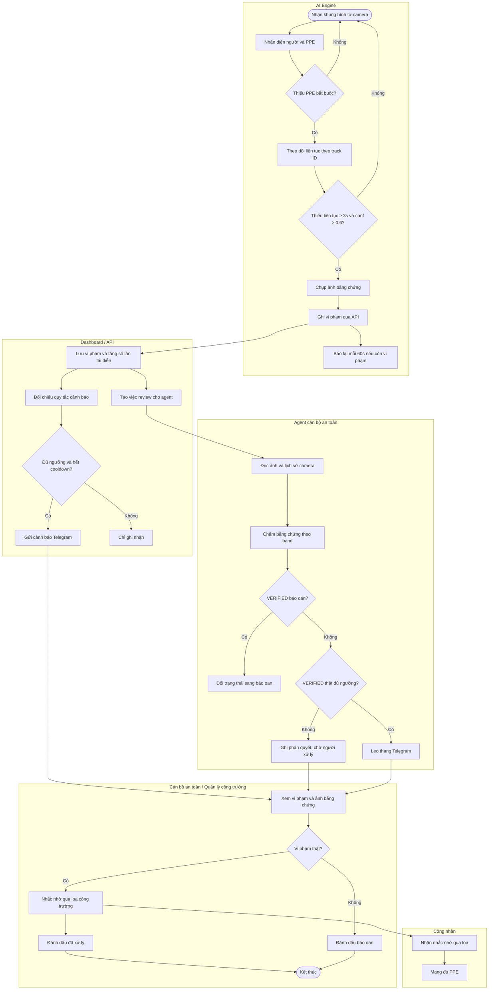
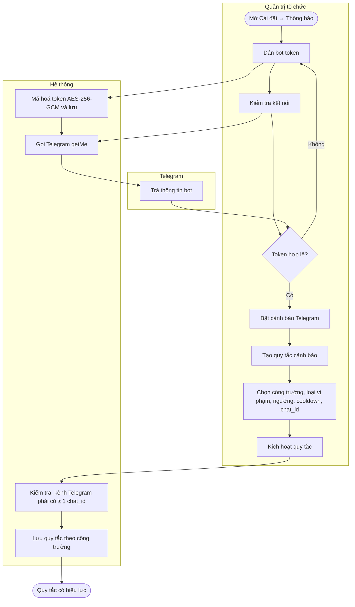
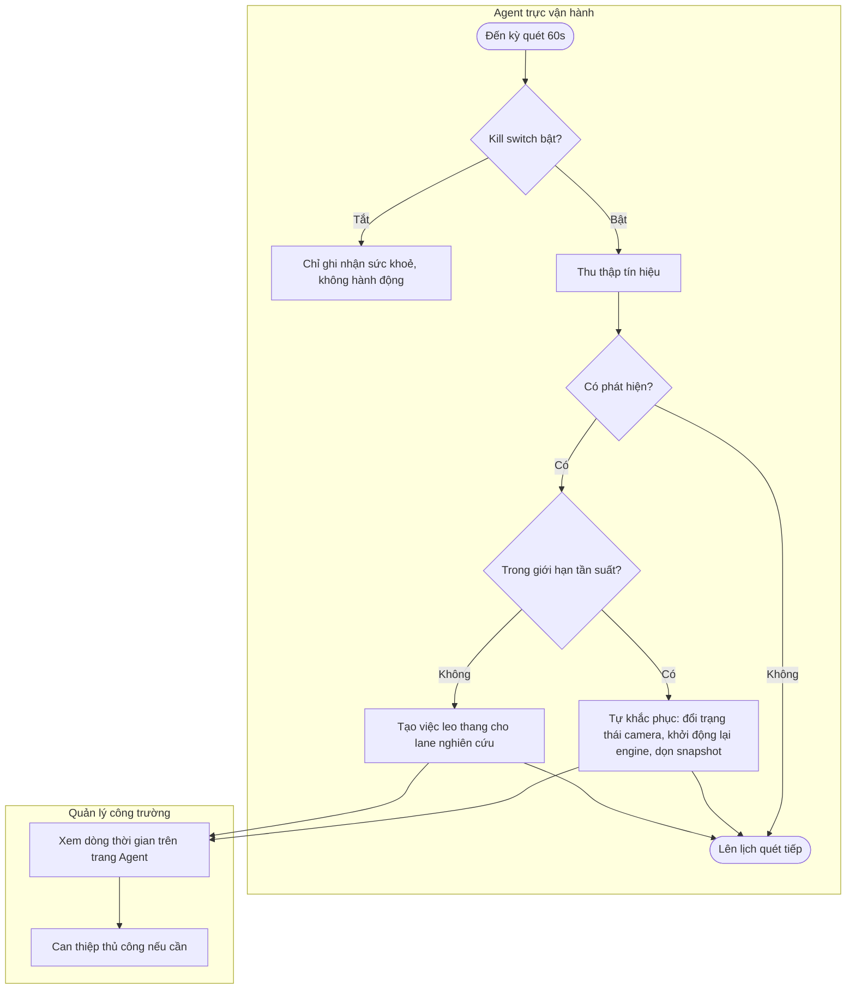

# 01 — Sơ đồ BPMN

Ba quy trình nghiệp vụ chính. Lane đặt theo nhóm tham gia; hệ thống (AI Engine, Agent, Telegram) có lane riêng vì tự hành động.

## QT-01 Giám sát và xử lý vi phạm PPE

**Đầu vào:** luồng video camera công trường (webcam / RTSP / video mẫu), danh sách camera `ONLINE`, quy tắc cảnh báo của công trường.
**Đầu ra:** bản ghi Vi phạm kèm ảnh bằng chứng, cảnh báo đã gửi, phán quyết của agent, trạng thái xử lý cuối cùng.

**Nghiệp vụ cần lưu ý**
- Một người thiếu nhiều món chỉ sinh **một** vi phạm theo món nghiêm trọng nhất: mũ (critical) > áo (high) > găng, giày (medium).
- Vi phạm chỉ chốt khi thấy liên tục ≥ 3s để giảm báo oan; còn kéo dài thì báo lại mỗi 60s kèm ảnh mới và tăng `occurrenceCount`.
- Telegram coi lần đầu là nhắc nhở, leo thang từ lần thứ hai; ngưỡng và cooldown do quy tắc cảnh báo của công trường quyết định.
- Agent chỉ tự đổi trạng thái khi bằng chứng đạt band VERIFIED; band PROBABLE / POSSIBLE để lại cho người quyết định.

## QT-02 Cấu hình cảnh báo cho công trường

**Đầu vào:** bot token Telegram, chat_id người nhận, chính sách cảnh báo của công trường.
**Đầu ra:** bot đã kiểm tra kết nối, quy tắc cảnh báo đang kích hoạt.

## QT-03 Agent trực vận hành (tự động, mỗi 60s)

**Đầu vào:** trạng thái camera, heartbeat AI engine, `/health` của bridge, dung lượng thư mục snapshot, file model.
**Đầu ra:** phát hiện sự cố đã ghi audit, hành động khắc phục trong giới hạn tần suất, leo thang khi vượt giới hạn.

Phát hiện hiện có: `camera.stalled`, `camera.recovered`, `engine.stalled`, `bridge.down`, `disk.pressure`, `model.missing`.
