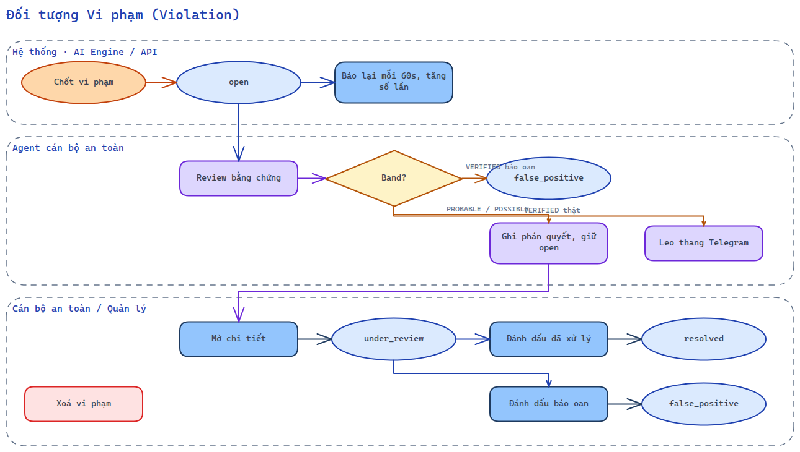
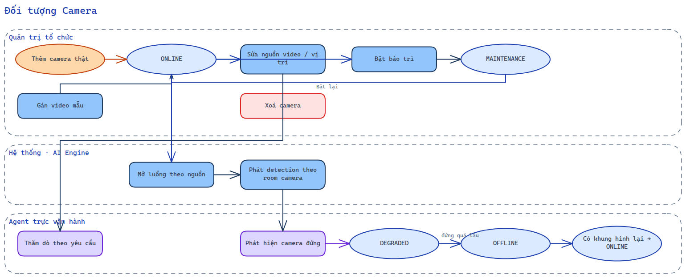
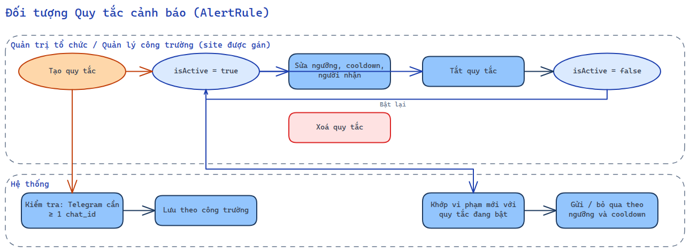
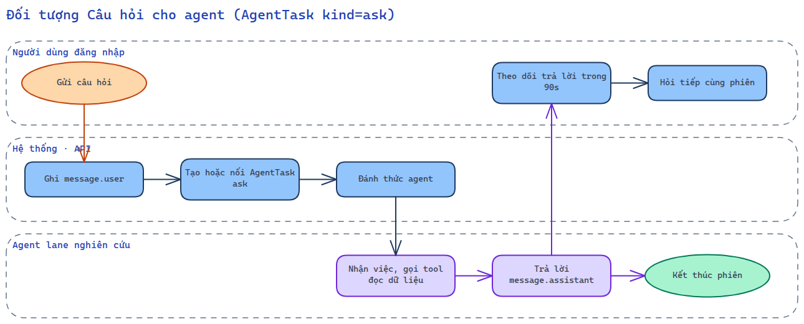

# 02 — Swimlane workflow theo đối tượng

Khác BPMN (theo quy trình), mỗi swimlane dưới đây mô tả **các thao tác trên một đối tượng** và trạng thái mà thao tác được phép thực hiện. Hệ thống là một tác nhân có lane riêng.

## Đối tượng: Vi phạm (Violation)

Sơ đồ vẽ bằng Excalidraw.

| Thao tác | Tác nhân | Trạng thái cho phép |
|---|---|---|
| Chốt vi phạm | AI Engine | — (tạo mới `open`) |
| Báo lại / tăng số lần | AI Engine | `open` |
| Review, ghi phán quyết | Agent | `open`, `under_review` |
| Tự đổi sang báo oan | Agent | `open` (chỉ khi VERIFIED) |
| Mở chi tiết (chuyển `under_review`) | Mọi vai trò đăng nhập | `open` |
| Đánh dấu đã xử lý | Mọi vai trò đăng nhập | `open`, `under_review` |
| Đánh dấu báo oan | Mọi vai trò đăng nhập | `open`, `under_review` |
| Xoá vi phạm | Mọi vai trò đăng nhập | mọi trạng thái (không hoàn tác) |
| Hỏi agent về vi phạm | Mọi vai trò đăng nhập | mọi trạng thái |

## Đối tượng: Camera

Sơ đồ vẽ bằng Excalidraw.

## Đối tượng: Quy tắc cảnh báo (AlertRule)

Sơ đồ vẽ bằng Excalidraw.

`*` Quản lý công trường chỉ thao tác trên công trường được gán (`assertSiteAccess`).

## Đối tượng: Câu hỏi cho agent (AgentTask kind=ask)

Sơ đồ vẽ bằng Excalidraw.
