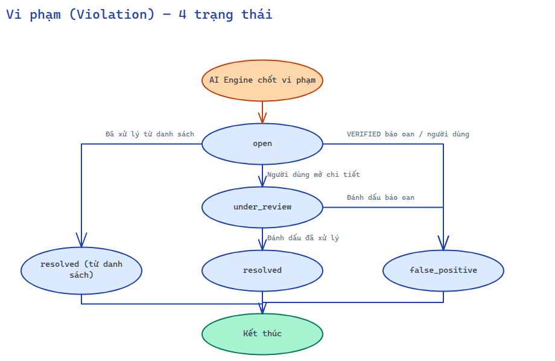
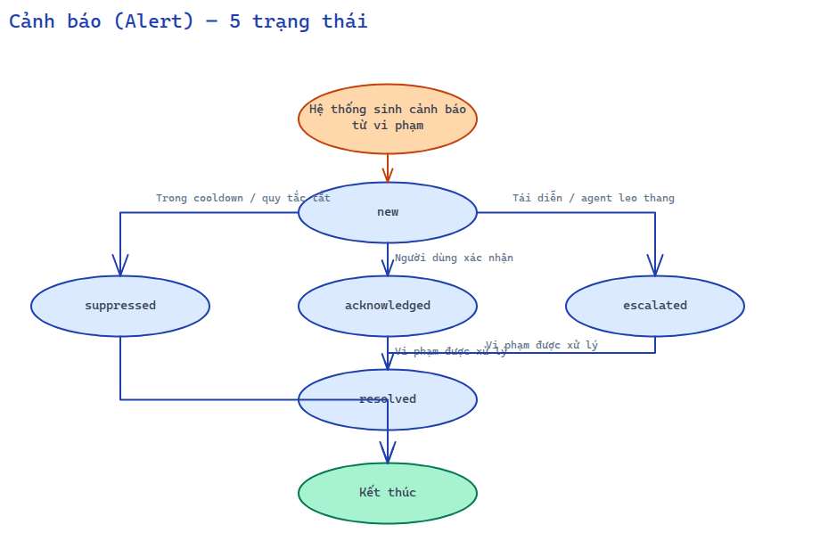
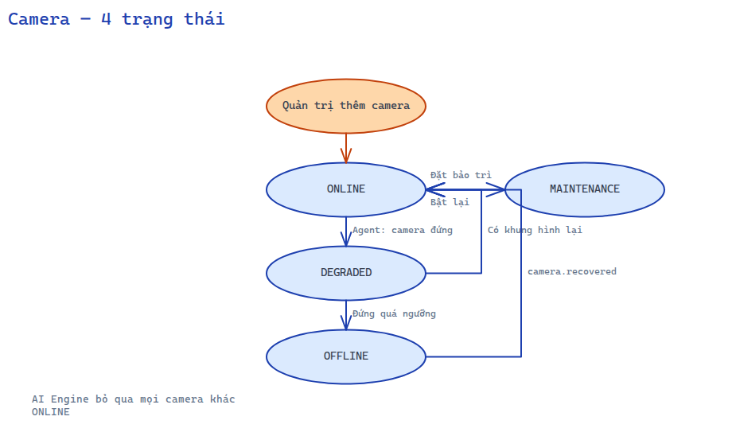
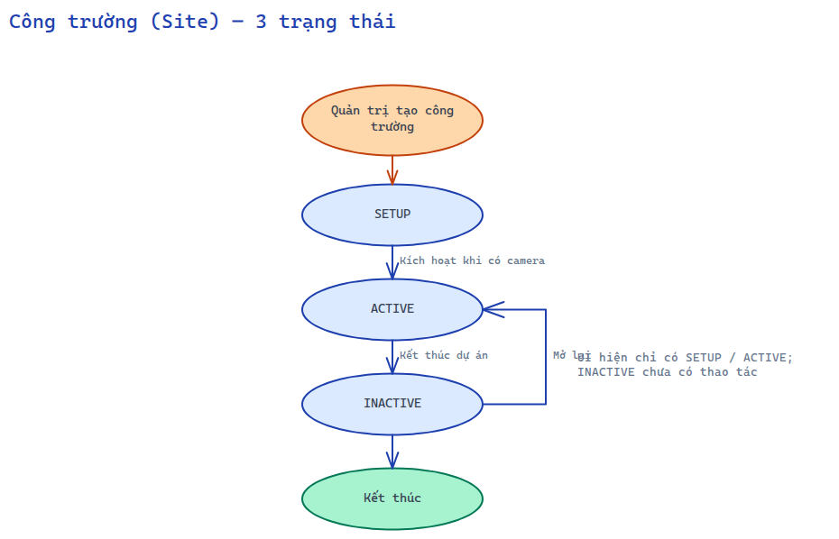
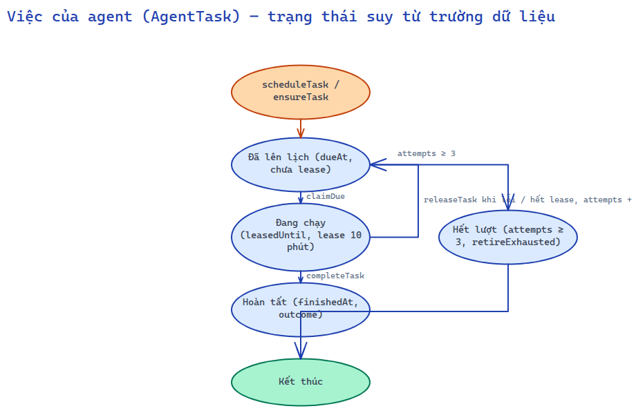

# 03 — Biểu đồ trạng thái

Quy tắc: basic flow chạy dọc giữa, nhánh phụ tách sang bên; cạnh ghi **hành động** gây chuyển trạng thái. Giá trị lưu DB là chữ HOA, API trả chữ thường (`src/types/enums.ts`).

## Vi phạm (Violation) — 4 trạng thái

Sơ đồ vẽ bằng Excalidraw.

## Cảnh báo (Alert) — 5 trạng thái

Sơ đồ vẽ bằng Excalidraw.

Hiện tại UI chỉ có nút xác nhận (`new → acknowledged`); `escalated` sinh từ Telegram leo thang; `suppressed` dành cho kênh chưa nối.

## Camera — 4 trạng thái

Sơ đồ vẽ bằng Excalidraw.

AI Engine bỏ qua mọi camera khác `ONLINE`.

## Công trường (Site) — 3 trạng thái

Sơ đồ vẽ bằng Excalidraw.

Giao diện hiện tại chỉ hiển thị SETUP / ACTIVE; INACTIVE có trong enum, chưa có thao tác trên UI.

## Việc của agent (AgentTask) — trạng thái suy từ trường dữ liệu

`AgentTask` không có cột `status`; trạng thái suy từ `dueAt`, `leasedUntil`, `attempts`, `finishedAt`, `outcome`.

Sơ đồ vẽ bằng Excalidraw.

## Đối tượng dưới 3 trạng thái (không vẽ)

| Đối tượng | Trạng thái | Lý do bỏ qua |
|---|---|---|
| Quy tắc cảnh báo (AlertRule) | `isActive` true / false | 2 trạng thái |
| Cấu hình Telegram | `isEnabled` true / false | 2 trạng thái |
| Cài đặt agent | `isEnabled` true / false (kill switch) | 2 trạng thái |
| Người dùng | `isActive` true / false | 2 trạng thái |
