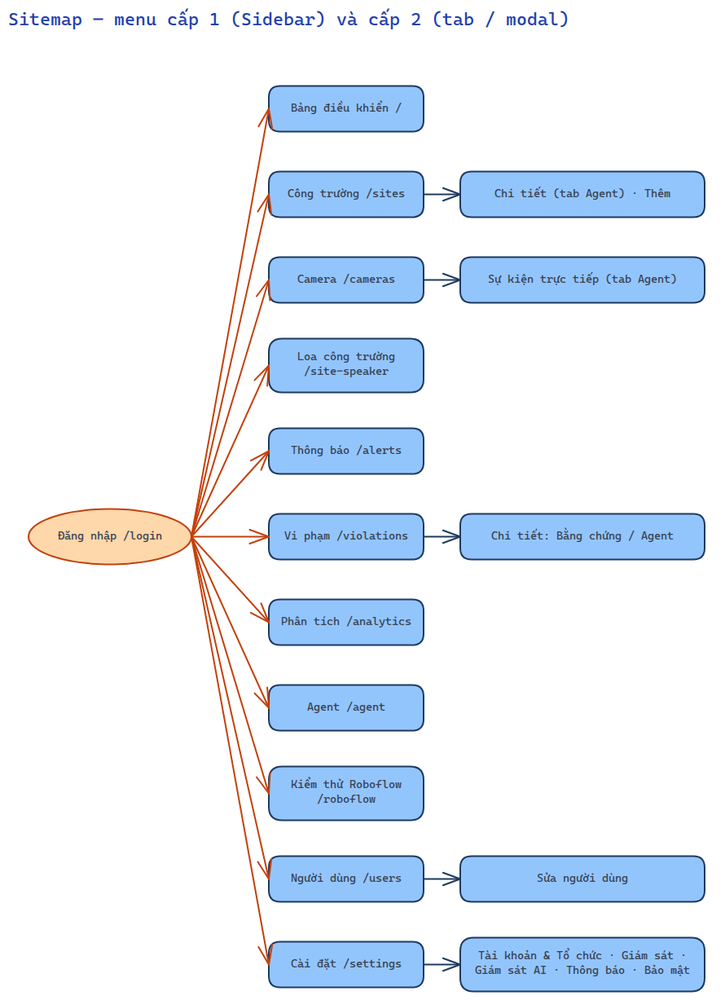

# 08 — Sitemap

Ứng dụng web: menu tối đa cấp 2. Cấp 1 là menu trái (Sidebar), cấp 2 là tab hoặc modal trong trang. Quyền xem theo [05-permission-matrix.md](05-permission-matrix.md).

Sơ đồ vẽ bằng Excalidraw.

| Cấp 1 (Sidebar) | Cấp 2 | Vai trò |
|---|---|---|
| Bảng điều khiển `/` | — | Tất cả |
| Công trường `/sites` | Chi tiết (tab Agent), Thêm | SUPER_ADMIN, ORG_ADMIN, SITE_MANAGER |
| Camera `/cameras` | Sự kiện trực tiếp (tab Agent) | Tất cả |
| Loa công trường `/site-speaker` | — | Tất cả |
| Thông báo `/alerts` | — | Tất cả |
| Vi phạm `/violations` | Chi tiết (Bằng chứng / Agent) | Tất cả |
| Phân tích `/analytics` | — | + SAFETY_OFFICER (không SUPERVISOR) |
| Agent `/agent` | — | SUPER_ADMIN, ORG_ADMIN, SITE_MANAGER |
| Kiểm thử Roboflow `/roboflow` | — | SUPER_ADMIN, ORG_ADMIN |
| Người dùng `/users` | Thêm, Sửa | SUPER_ADMIN, ORG_ADMIN |
| Cài đặt `/settings` | 6 tab (thêm "Nhật ký") | SUPER_ADMIN, ORG_ADMIN |
| Hồ sơ `/profile` (vào từ menu avatar Header, không có trong Sidebar) | Đổi mật khẩu | Tất cả |

Trang chưa có (lộ trình P2): Báo cáo `/reports`.
