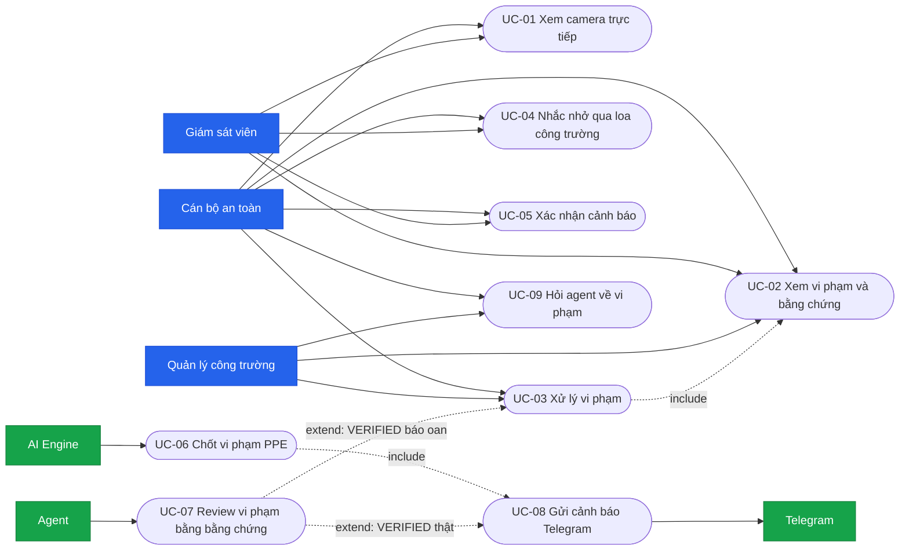
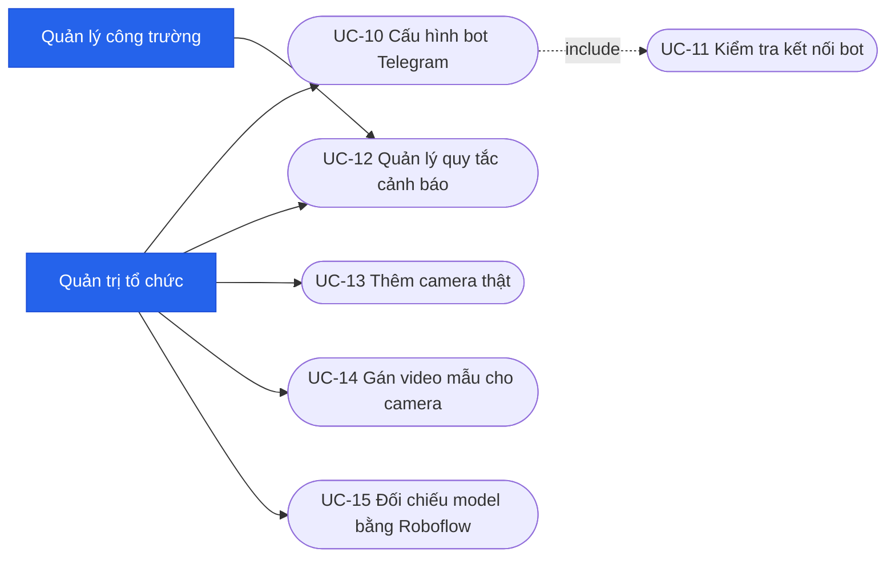
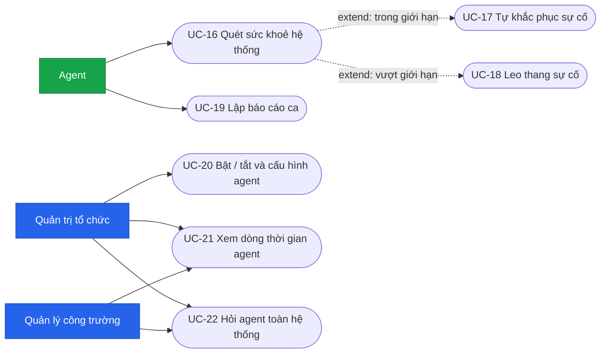
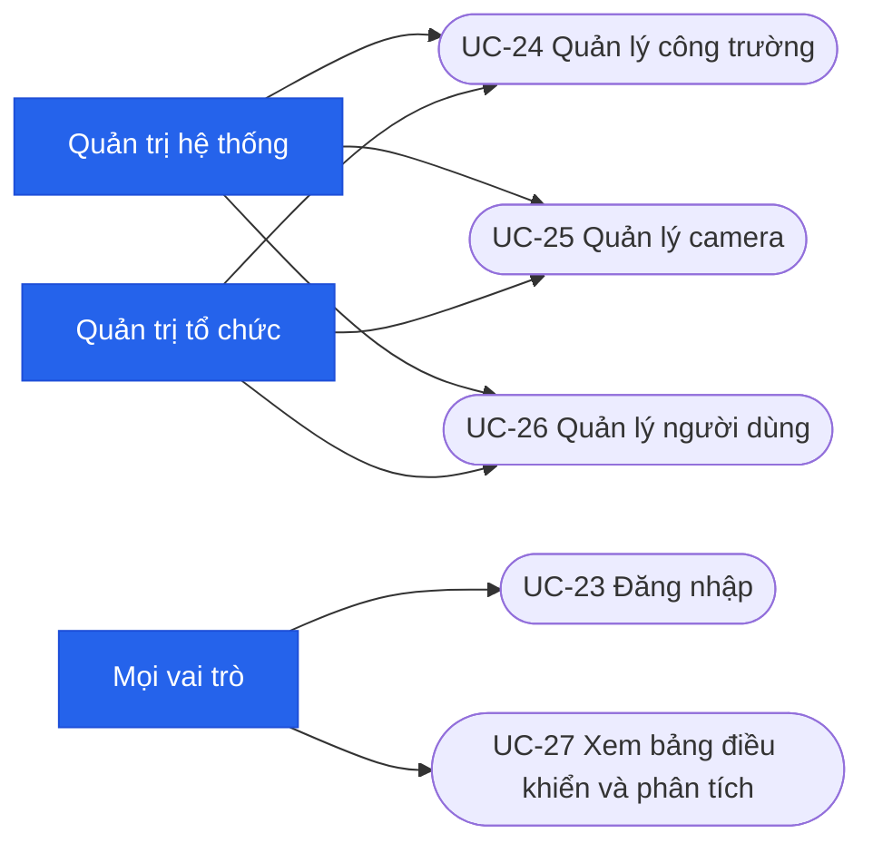

# 09 — Sơ đồ use case

Actor tô màu; use case đặt tên **động từ + danh từ**; mỗi biểu đồ ≤ 10 use case cùng cấp. Danh mục quản trị chỉ CRUD gộp vào một biểu đồ.

## UCD-01 Giám sát và xử lý vi phạm

## UCD-02 Cấu hình cảnh báo và giám sát

## UCD-03 Vận hành agent

## UCD-04 Danh mục quản trị (CRUD)

