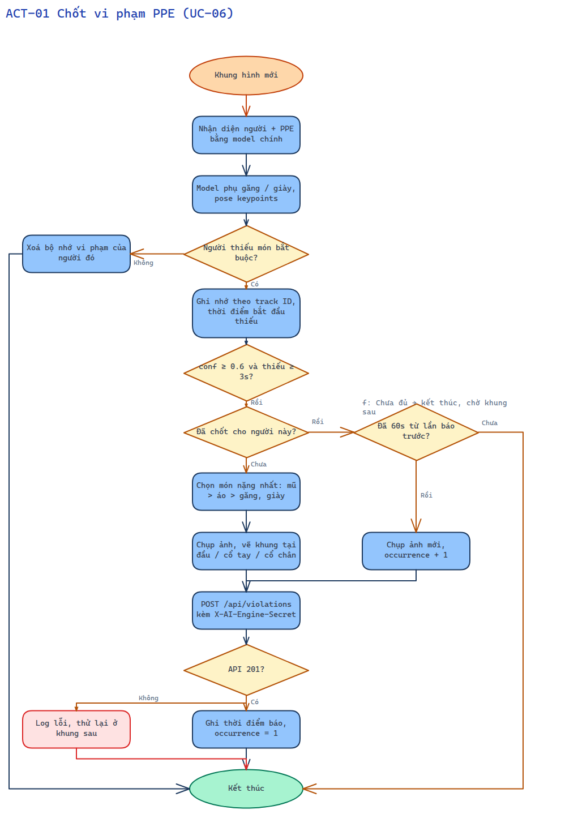
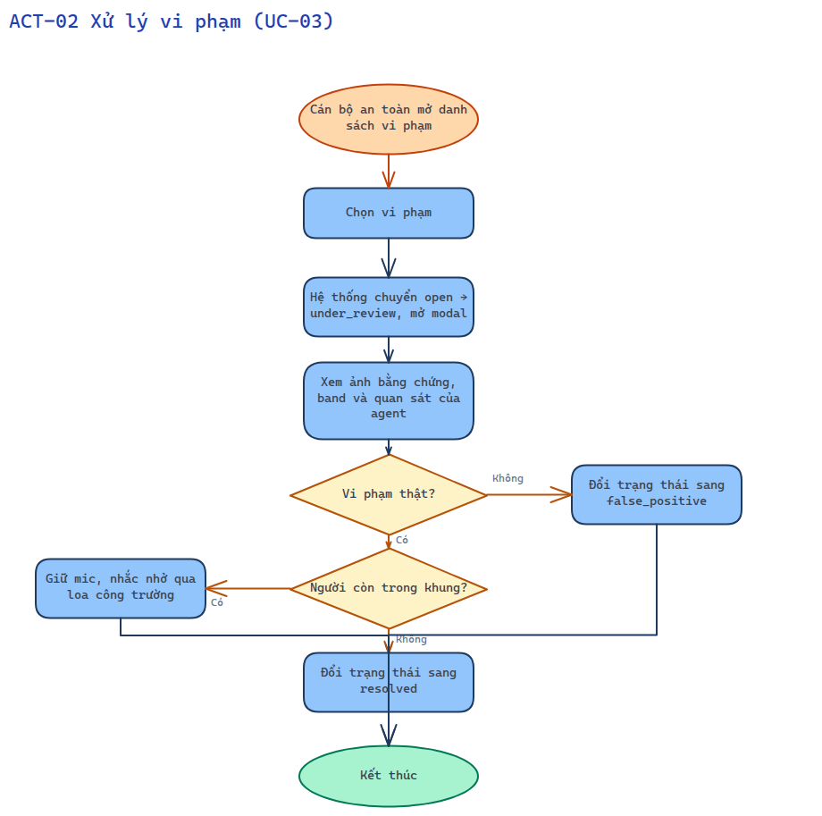
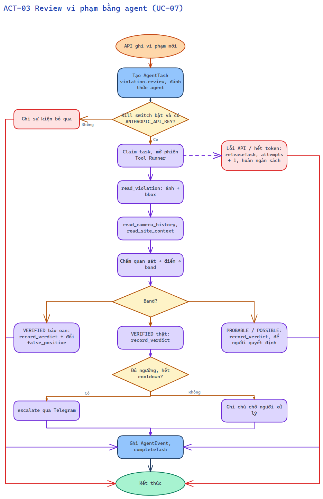
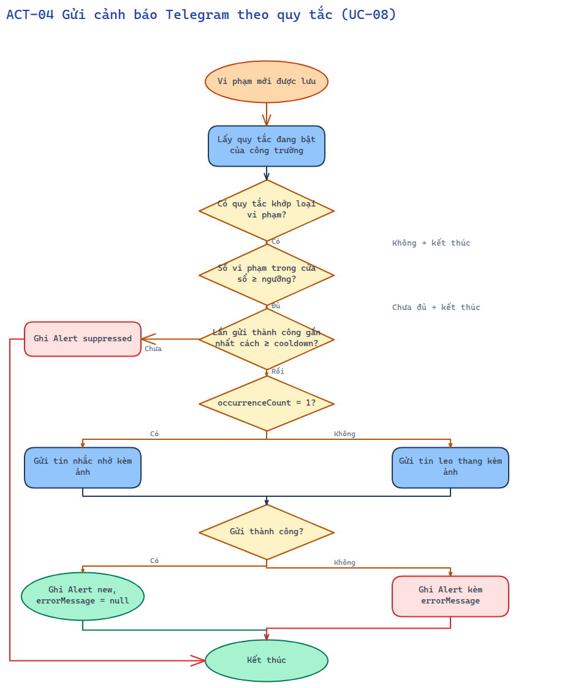
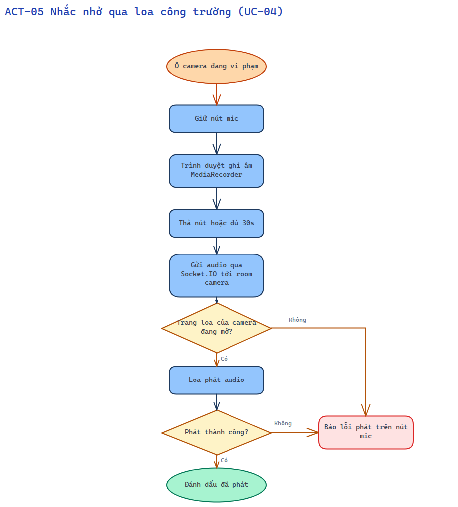

# 10 — Sơ đồ luồng chức năng (activity)

Chọn từ biểu đồ use case những nghiệp vụ có luồng xử lý. Mỗi sơ đồ có điểm bắt đầu (hoạt động kích hoạt) và điểm kết thúc (xử lý thành công).

## ACT-01 Chốt vi phạm PPE (UC-06)

Sơ đồ vẽ bằng Excalidraw.

## ACT-02 Xử lý vi phạm (UC-03)

Sơ đồ vẽ bằng Excalidraw.

## ACT-03 Review vi phạm bằng agent (UC-07)

Sơ đồ vẽ bằng Excalidraw.

## ACT-04 Gửi cảnh báo Telegram theo quy tắc (UC-08)

Sơ đồ vẽ bằng Excalidraw.

## ACT-05 Nhắc nhở qua loa công trường (UC-04)

Sơ đồ vẽ bằng Excalidraw.
