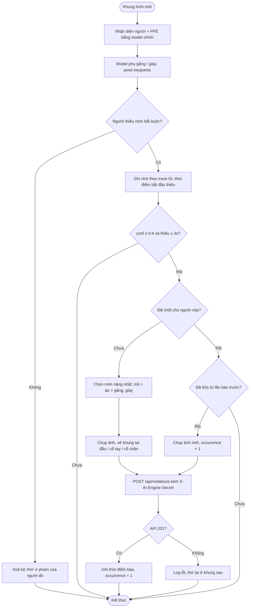
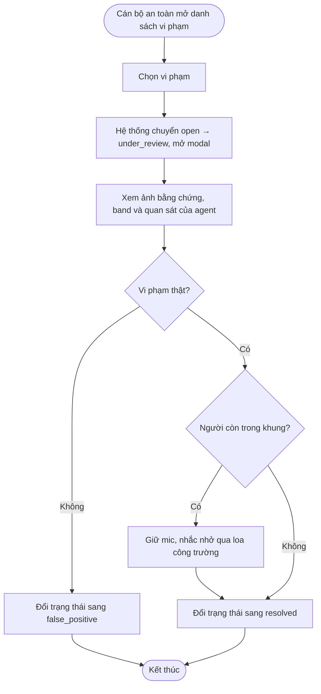
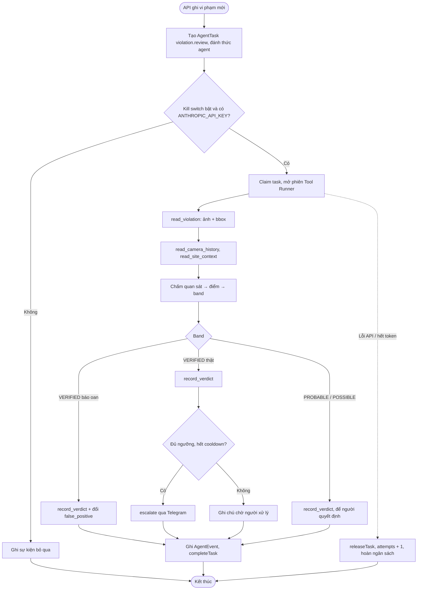
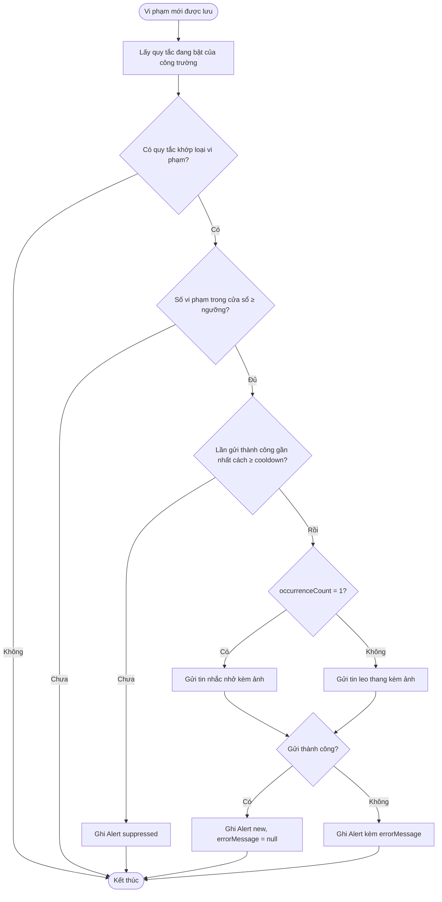
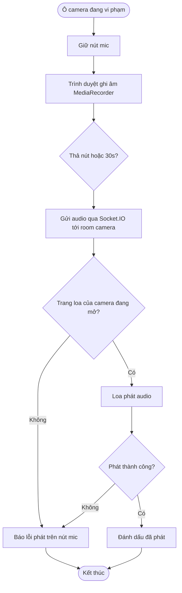

# 10 — Sơ đồ luồng chức năng (activity)

Chọn từ biểu đồ use case những nghiệp vụ có luồng xử lý. Mỗi sơ đồ có điểm bắt đầu (hoạt động kích hoạt) và điểm kết thúc (xử lý thành công).

## ACT-01 Chốt vi phạm PPE (UC-06)

## ACT-02 Xử lý vi phạm (UC-03)

## ACT-03 Review vi phạm bằng agent (UC-07)

## ACT-04 Gửi cảnh báo Telegram theo quy tắc (UC-08)

## ACT-05 Nhắc nhở qua loa công trường (UC-04)

